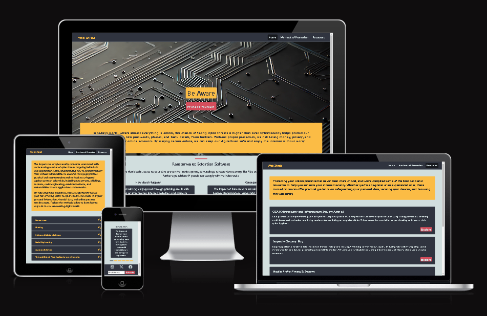

# Web Shield

**Overview**

Web Shield is a website dedicated to enhancing user awareness of common cybersecurity threats. It aims to educate users on different types of cyberattacks, such as ransomware, phishing, and malware, and offers practical advice on how to mitigate these risks. The site provides easy-to-understand explanations and actionable steps that users can take to protect their online presence.

**Purpose**

The purpose of Web Shield is to empower individuals and small businesses by providing them with the knowledge and tools necessary to improve their cybersecurity posture. With the rise of cyber threats, many users feel overwhelmed by the technical aspects of security. Web Shield simplifies the complexities of cybersecurity, offering clear, practical steps to stay safe online.

**Target Audience**

The target audience for Web Shield includes:

- Individuals looking to protect their personal data and secure their devices.
- Small business owners who want to safeguard their businesses from cyber threats.
- Non-technical users who need simple, effective advice on how to avoid common online security pitfalls.
These users will benefit from the easy-to-follow advice and resources on the site, which are designed to be accessible to those without a deep technical background.

**User Stories**

Must-Have User Stories

User story #1: As a user, I want to see a clear and structured Homepage so I can easily understand the website's purpose.

Acceptance criteria:

- Create navigation
- Add important information on the homepage
- Add feedback to the buttons so users can understand where they are

User story #2: As a user, I want to see simple ways to protect myself online so I can implement them without external support.

Acceptance Criteria:

- Create method.html file
- Use the accordion component for each threat
- Display the basic protection methods for each threat

### Design Decisions

**Wireframes**

[WebShieldWireframes.pdf](assets/wireframes/WebShield.pdf)

The design of the website was intentionally crafted to provide a visually comfortable experience, minimizing strain on the user’s eyes while highlighting important information with the use of color. The layout adheres to modern web design principles, ensuring clarity and ease of use.

**Font and Spacing Choices**

The font size, line height, and letter spacing were carefully selected to optimize readability. By creating sufficient space between lines and characters, users can comfortably read the content without feeling overwhelmed by densely packed text.

*Homepage Carousel*

On the homepage, a carousel component was implemented to allow users to quickly glance through the website's main features without excessive scrolling. This design choice enhances user engagement by offering easy navigation. Additionally, the automatic scrolling feature was disabled, allowing users to control the pace of content consumption. This ensures that they can fully absorb the information at their own speed before moving on.

*Accordion for Methods Page*

On the "Methods" page, an accordion component was used to efficiently organize information. This enables users to selectively expand sections to view the content relevant to them, avoiding an overwhelming display of all information at once. The accordion structure helps maintain a clean, structured appearance while offering quick access to details.

*Resource Cards*

The "Resources" page is equipped with a card component, providing users with a brief overview of each available resource. The card layout not only organizes information efficiently but also offers a visually appealing way for users to scan through different resources and select the ones that interest them most. This structure keeps the page from becoming cluttered, promoting a smooth browsing experience.

By blending user-friendly components like the carousel, accordion, and cards with thoughtful typography and color use, the website ensures a seamless and engaging user experience.

**Accessibility Considerations**

To ensure the website adheres to accessibility guidelines, several key elements were implemented, keeping in mind the Web Content Accessibility Guidelines (WCAG).

*Icon Alt Text for Screen Readers*

All icons on the website were provided with descriptive alternative text (alt text) to ensure that users who rely on screen readers can access the meaning and functionality of these icons. This step enhances the overall accessibility by providing a clear description of visual elements, ensuring that visually impaired users can navigate the site effectively.

*Navigation and Page Indicators*

In the navigation bar, a “current page” label was added to indicate the active page the user is on. This assists users with disabilities, particularly those using screen readers, to better understand their current location within the website. By clearly identifying the active page, the navigation experience becomes more intuitive, especially for users who may find it challenging to navigate complex website structures.

These adjustments ensure that the website is more accessible to a broader range of users, meeting important accessibility standards and creating an inclusive experience for all visitors.

### AI Tools Usage

*ChatGPT*

ChatGPT was used to create a custom background image for the homepage, which added a modern and tech-savvy feel to the site. This visually engaging background aligned with the cybersecurity theme, enhancing the overall aesthetic and atmosphere of the website.

ChatGPT played a key role in generating text-based content for the website. It was used to craft informative and readable descriptions, helping to streamline complex topics into user-friendly language. By processing the provided content, ChatGPT enhanced its clarity and engagement, ensuring that the information was not only accurate but also easy to understand for a wide audience.

The tool was particularly effective in creating concise summaries, improving the overall readability and flow of the website's text. Additionally, it supported the formatting and refinement of content, making sure the website maintains a professional tone while being approachable for users unfamiliar with cybersecurity concepts.

### Features Implementation

**Core Features (Must-Haves)**

Feature 1: Structured Homepage

The homepage was designed to provide clear navigation and essential information so users can easily understand the purpose of the website. Key components such as a well-organized layout and an intuitive navigation bar were implemented. Additionally, feedback mechanisms were added to buttons, ensuring users can track their location on the site effortlessly.

Acceptance Criteria:

- Navigation bar created with links to key sections.
- Homepage includes essential introductory information about the website’s focus on cybersecurity.
- Buttons provide visual feedback when clicked or hovered over, making it clear to users where they are.

Feature 2: Protection Methods

To help users easily understand how to protect themselves online, a dedicated "Methods" page was created. This page uses the accordion component to display various - cybersecurity threats and the associated protection methods, providing simple, actionable advice that users can implement without external assistance.

Acceptance Criteria:

- A separate methods.html file was created.
- An accordion component was implemented for each threat, such as Ransomware and Phishing.
- Protection methods are displayed for each threat in an easy-to-understand format.

**Advanced Features (Should-Haves)**

Feature 1: Useful Resource Links

The resources page was developed to give users access to external tools and websites that can help improve their online safety. Each resource is displayed on a card, and an “Explore” button is provided for each, which opens the resource in a new tab to prevent users from losing their place on the main site.

Acceptance Criteria:

- A dedicated resources.html page was created.
- Each resource is displayed within a card component, with a description and an “Explore” button.
- Links are set to open in a new tab using the target="_blank" attribute, ensuring users stay on the main site.

**Optional Features (Could-Haves)**

While there are no optional features currently implemented, future enhancement could integrate real-time security alerts that keep users informed of the latest online threats.

### Testing and Validation

**Testing Results**

The website was tested across various devices and screen sizes using Chrome DevTools' responsive testing tools, ensuring compatibility and a consistent user experience across desktop, tablet, and mobile views. Additionally, the site was tested on actual mobile devices to verify that all features work seamlessly on smaller screens. All key functionalities, including navigation, buttons, and interactive elements like the accordion and carousel, operated smoothly.

Issues Identified:

Minor adjustments were needed for font sizes on smaller screens to enhance readability.
Some padding was altered to ensure that buttons and clickable elements were easy to interact with on mobile devices.
These issues were resolved by fine-tuning the CSS for better responsiveness.

**Validation**

The HTML code was validated using the W3C Markup Validation Service, and the CSS was validated through the W3C CSS Validation Service. Both validations were successful, with no errors or significant warnings.

HTML Validation: All pages passed validation, confirming that the structure and syntax are compliant with web standards.
CSS Validation: The site's styling was also successfully validated, ensuring adherence to CSS standards.
No major issues were found during the validation process, further confirming the site's compliance with web standards and best practices.

### Deployment

**Deployment Process**

The website was successfully deployed to GitHub Pages. The deployment process involved committing the latest code to the main branch of the GitHub repository, then activating GitHub Pages from the repository settings by selecting the branch and root directory as the deployment source.

Once deployed, the site underwent additional testing to ensure everything was functioning correctly in a live environment.

*Challenges Encountered:*

After deployment, minor bugs were identified, particularly concerning font sizes on smaller screens, which affected readability.
Padding adjustments were also necessary to make buttons and interactive elements more user-friendly on mobile devices.
These issues were quickly resolved by refining the CSS and padding to improve overall mobile responsiveness.
Some elements retained focus after being clicked.

**Reflection on Development Process**

*Successes*

One of the significant achievements during the development process was the effective use of AI tools like ChatGPT. ChatGPT played a key role in generating clear and informative text content, making the website more engaging and readable for users. It was also used to create a background image featuring microchips for the homepage, adding a professional aesthetic to the site.

*Challenges*

The majority of problem-solving came from manual searches through Google, which provided more targeted and accurate solutions to coding and design challenges.

*Final Thoughts*

Overall, the development process was a positive learning experience, with AI tools proving to be a valuable asset for content creation and coding assistance. However, traditional search engines and manual debugging still played a crucial role in solving more complex issues. This combination of AI support and conventional problem-solving approaches contributed to a well-rounded and successful project.

### Code Attribution

Several design elements and layout choices for this website were inspired by other projects:

*LoveRunning:* Certain layout and typography ideas were derived from this project
*Whiskey Drop:* The website's navigation structure and general flow were influenced by this project.
*Love Rosie:* Responsive design were inspired by this project.
*Walk 'n' Talk:* This project inspireв color for some elements.

### Future Improvements

Looking ahead, several enhancements and features could be added to the project to further enrich the user experience and provide valuable information:

*Real-Time Cybersecurity News Updates:* Implementing a dedicated section for the latest news in cybersecurity would keep users informed about emerging threats and trends. This could include articles on the newest vulnerabilities, data breaches, and security practices.

*Insightful Case Studies:* Including reports on significant cybersecurity failures and their consequences over the years would provide users with critical insights into the importance of robust security measures. By learning from past incidents, users could better appreciate the necessity of proactive protection.

These improvements would not only enhance the site's content but also empower users with the knowledge they need to protect themselves online effectively.

[def]: assets/images/image.png